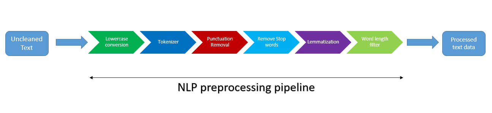

# IQVIA_Coding_Assignment
 LDA modeling and finding optimal no. of topics
 
 ## Coding Assignment
<i>Q: Write a python class with different function to fit LDA model, evaluate optimal number of topics based on best coherence scores and predict new instances based on best LDA model with optimal number of topics based on best coherence score. Function should take 2darray of embeddings as input and return a LDA model, optimal number of topics and topics.</i> 

### Step 1: Import neccessary Libraries

### Step 2: Load the dataset
This dataset contains a set of research articles related to computer science, mathematics, physics and statistics. Each article is tagged into major and minor topics in the form one hot encoding. 
But for our task (topic modeling) we don't need the tags, we just need the articles text. 
From the dataset we will form a list of articles 

### Step 3: Creating a Data Preprocessing Pipeline

This is the most important step in this entire code . We cannot expect good results from a model trained on a uncleaned data. 
As the famous quote goes <i>"garbage in,garbage out"</i> 
We want our corpus consisting a list of representative words capturing the essence of each article, To achieve that we need to follow a sequence of steps: 

 

### Step 4: Finalizing the input data
In this step we will form our the inputs of model, which are: 
* **Corpus**: A 2D embedded array of tuples, where each tuple is in the form of (token id, frequency of token in that document).
* **dictionary**: A dictionary storing the mapping from token to id. 

### Step 5: Modeling and Evaluation
In this part we will fit our data to our the LDA model , some hyper parameter tuning , evaluate the results and select the optimal setting for our model.

**Note**: Computing the optimal number of topics for LDA will take a pretty long amount of time 
The time complexity of this process : **O( m * x * p)** 
where: 
* m = no. of tokens in the corpus
* x = summation of no. of topics given in the range
* p = no. of passes for LDA model

### Step 6: Visualization

### Goals

:heavy_check_mark: Fitting a LDA model.
:heavy_check_mark: Finding a the optimal no. topics with best coherence score.
:heavy_check_mark: Returning the LDA model with optimal topics.
:heavy_check_mark: Returning the optimal no. of topics.
:heavy_check_mark: Returning the topics itself.
